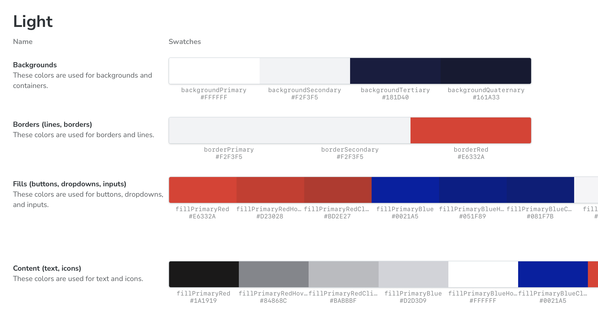

# CSPR.design

CSPR.design is a React-based UI component library powering the CSPR.suite application family, including [CSPR.live](https://cspr.live) and [Casper Wallet](https://casperwallet.io). It provides a consistent design language, reusable components, and shared styling utilities to ensure a cohesive user experience across products. CSPR.design enables faster development, easier maintenance, and a unified brand presence throughout the Casper Ecosystem.

✅ **Battle-tested** components from production apps \
✅ **Blockchain-focused** with Casper-specific utilities \
✅ **Consistent design** across the Casper ecosystem

[](https://github.com/make-software/cspr-design)
[](https://www.typescriptlang.org/)
[](https://cspr.live)

---

## Get started

Install from [NPM](https://www.npmjs.com/package/@make-software/cspr-design) to access ready-to-use components that bring the beloved [Casper blockchain](https://casper.network) community UI to your dApp:

```bash
npm install @make-software/cspr-design
```

Save time on design and implementation with a consistent Casper Network look:

```jsx
import {
  CSPR,
  BodyText,
  FlexColumn,
  PrecisionCase
} from '@make-software/cspr-design';

const MyApp = () => (
  <FlexColumn itemsSpacing={20}>
    <BodyText size={2}>Account Balance:</BodyText>
    <CSPR
      motes="50000000000000"
      precisionCase={PrecisionCase.full}
    />
  </FlexColumn>
);
```

## Storybook examples

Explore [CSPR.design Storybook](https://storybook.cspr.design) for live previews of every component, complete with usage guidelines and props. See how each UI element behaves in real-world scenarios. No guesswork, just plug and play.




## Troubleshooting

Please add the following to your `vite.config.js` if you are experiencing issues with `vite` and `styled-components`:

```js
resolve: {
  alias: {
    'styled-components': resolve(__dirname, 'node_modules', 'styled-components'),
  },
},
```

[See styled-components FAQ →](https://styled-components.com/docs/faqs#why-am-i-getting-a-warning-about-several-instances-of-module-on-the-page)

---

## Resources


📕 **[Storybook](https://storybook.cspr.design)**: Interactive examples  
🐞 **[GitHub Issues](https://github.com/make-software/cspr-design/issues)**: Please report issues here  
💬 **[Casper Telegram Community](https://t.me/CSPRDevelopers)**: Ask developers and fellow builders for help

---

<div align="center">

⭐ **Star this repo if CSPR.design helped you build something cool!**  


Built by [MAKE](https://makegroup.io) for the Casper ecosystem
</div>
